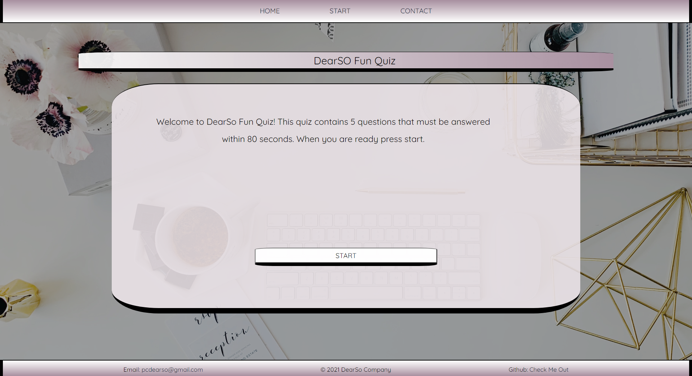

# sophk_fun_quiz
Created a fun simple quiz from basic javascript css and html.

# Fun Quiz 

    This file contains the basic html, css, and js files for a webpage that contains 5 short randomized question, 
    include naviagtion bar, timer, scoreboard, and score based on correct and incorrect answers. 

# Authors
    Sophia Kiani 
    Version 1.1

# Screen Shot
`
    

    
# Link
`
    [Check out Sophk Fun Quiz webpage...](https://soph-k.github.io/sophk_fun_quiz/)
    [Or check out the GitHub repository for the Sophk Fun Quiz webpage](https://github.com/soph-k/sophk_fun_quiz/) 
    
 

# Bugs

    There are currently no known bugs within this file, however, it is not a functional webpage yet.
