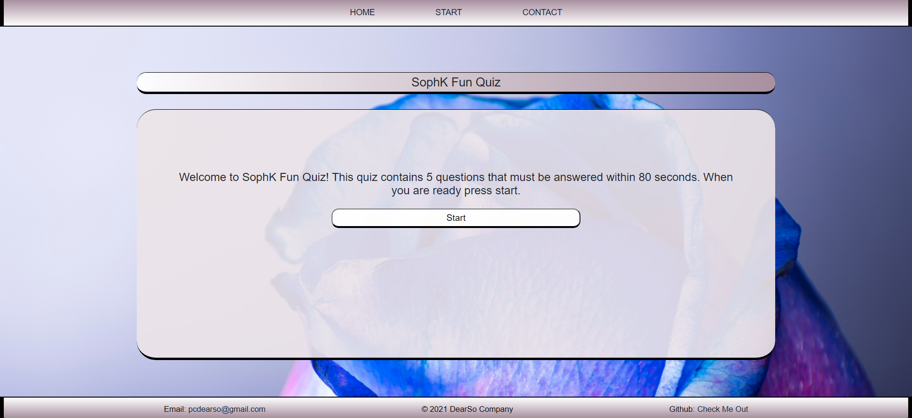

# Sophk Fun Quiz

# Fun Quiz 

    This file contains basic html, css, and js files for a webpage that contains 5 short randomized question, 
    include naviagtion bar, timer, scoreboard, and score based on correct and incorrect answers. 

## Authors
   - Author: Sophia
   - GitHub: [soph-k](https://github.com/soph-k)
   - Version 1.1

##  Link to Deployed Page
`
    [Live Demo](https://soph-k.github.io/sophk_fun_quiz/)

# Screen Shot
`
    

# Features

    - HTML 
    - CSS 
    - Javascript 
    - JQuery 
    - Bootstrap

## Link to Repo Page
`
    [Repo](https://github.com/soph-k/sophk_fun_quiz/) 

